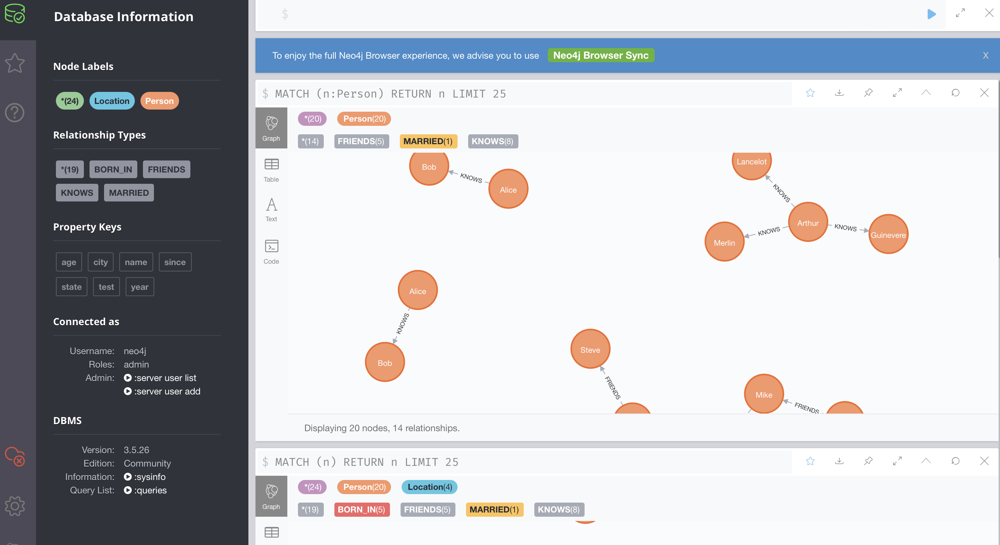

# Datawhale 知识图谱组队学习 之 Task 1 知识图谱介绍

## 〇、目录

[toc]


## 一、知识图谱简介

### 1.1 引言

知识图谱（Knowledge Graph）/语义网，用来描述真实世界中存在的各种实体或概念及其关系。

常见于信息检索、自然语言理解、推荐系统


备注：

像论文关系图，也可以认为是一种知识图谱吧，这种（可视化）描述对于检索相关资料有很大帮助。

### 1.2 是什么？

知识图谱是由 Google 公司在 2012 年提出来的一个新的概念。从学术的角度，我们可以对知识图谱给一个这样的定义：“知识图谱本质上是语义网络（Semantic Network）的知识库”。但这有点抽象，所以换个角度，从实际应用的角度出发其实可以简单地把知识图谱理解成多关系图（Multi-relational Graph）。

它的概念包含两部分，首先中心词是图，一种计算机、数学常用结构，其次，是知识，是一些现实世界的抽象映射（或许，也可以本来是抽象映射）。

考虑一个简单的常见的场景，关于知乎等社交网站的用户信息。将用户是为点，链接关注关系，便可形成一张容易想象的图。在这个里面，正好用户、关系对应图的概念。以下详解。

#### 1.2.1 什么是图（Graph）？

图（Graph）是由节点（Vertex）和边（Edge）来构成。结点表示实体或概念，边由属性或关系构成。

容易想到一种节点、一种边的图。但由于现实的复杂性，常常有不同类型的点、不同类型的边。多关系图一般正式这样。其中

* 实体（节点）指的是现实世界中的事物比如人、地名、概念、药物、公司等
* 关系（边）则用来表达不同实体之间的某种联系，比如人-“居住在”-北京、张三和李四是“朋友”、逻辑回归是深度学习的“先导知识”等等。

#### 1.2.2 什么是 Schema ？

另外一个很重要的概念是 Schema:
- 介绍：限定待加入知识图谱数据的格式；相当于某个领域内的数据模型，包含了该领域内有意义的概念类型以及这些类型的属性
- 作用：规范结构化数据的表达，一条数据必须满足Schema预先定义好的实体对象及其类型，才被允许更新到知识图谱中， **一图胜千言**
  - 图中的DataType限定了知识图谱节点值的类型为文本、日期、数字（浮点型与整型）
  - 图中的Thing限定了节点的类型及其属性（即图1-1中的边）
- 举例说明：基于下图Schema构建的知识图谱中仅可含作品、地方组织、人物；其中作品的属性为电影与音乐、地方组织的属性为当地的商业（eg：饭店、俱乐部等）、人物的属性为歌手
- tips：本次组队学习不涉及schema的构建


### 1.3 价值？

从图中可以看出，知识图谱是人工智能很重要的一个分支, 人工智能的目标为了让机器具备像人一样理性思考及做事的能力 ->
  在符号主义的引领下，知识工程（核心内容即建设专家系统）取得了突破性的进展 ->
  在整个知识工程的分支下，知识表示是一个非常重要的任务 ->
  而知识图谱又恰恰是知识表示的重要一环

实体间的关系，是一种更高维度的知识，较之实体。


## 二、怎么构建？

### 2.1 数据来源？

知识图谱的构建是后续应用的基础，而且构建的前提是需要把数据从不同的数据源中抽取出来。对于垂直领域的知识图谱来说，它们的数据源主要来自两种渠道：
- 第一种：业务本身的数据。这部分数据通常包含在公司内的数据库表并以结构化的方式存储，一般只需要简单预处理即可以作为后续AI系统的输入；
- 第二种：网络上公开、抓取的数据。这些数据通常是以网页的形式存在所以是非结构化的数据，一般需要借助于自然语言处理等技术来提取出结构化信息。
  


比如在下面的搜索例子里，Bill Gates和Malinda Gate的关系就可以从非结构化数据中提炼出来，比如维基百科等数据源。


### 2.2 信息抽取的难点在哪里？

信息抽取的难点在于处理非结构化数据。在下面的图中，我们给出了一个实例。左边是一段非结构化的英文文本，右边是从这些文本中抽取出来的实体和关系。


### 2.3 构建涉及技术？

在构建类似的图谱过程当中，主要涉及以下几个方面的自然语言处理技术： 

1. 实体命名识别（Name Entity Recognition）
2. 关系抽取（Relation Extraction）
3. 实体统一（Entity Resolution）
4. 指代消解（Coreference Resolution）
5. ...

除自然语言之外，还有各种非关系型数据库、大数据等相关信息

下面针对每一项技术解决的问题做简单的描述，至于这些是具体怎么实现的，不在这里一一展开，后续课程和知识图谱第二期的课程将会慢慢展开：


#### 2.3.1 实体命名识别（Named Entity Recognition）

- 实体命名识别（英语：Named Entity Recognition），简称NER
  - 目标：就是从文本里提取出实体并对每个实体做分类/打标签；
  - 举例说明：比如从上述文本里，我们可以提取出实体-“NYC”，并标记实体类型为 “Location”；我们也可以从中提取出“Virgil's BBQ”，并标记实体类型为“Restarant”。
  - 这种过程称之为实体命名识别，这是一项相对比较成熟的技术，有一些现成的工具可以用来做这件事情。

#### 2.3.2 关系抽取（Relation Extraction）

- 关系抽取（英语：Relation Extraction），简称 RE
  - 介绍：通过关系抽取技术，把实体间的关系从文本中提取出来；
  - 举例说明：比如实体“hotel”和“Hilton property”之间的关系为“in”；“hotel”和“Time Square”的关系为“near”等等。


#### 2.3.3 实体统一（Entity Resolution）

- 实体统一（英语：Entity Resolution），简称 ER
  - 介绍：对于有些实体写法上不一样，但其实是指向同一个实体；（简单的例子，昵称）
  - 举例说明：比如“NYC”和“New York”表面上是不同的字符串，但其实指的都是纽约这个城市，需要合并。
  - 价值：实体统一不仅可以减少实体的种类，也可以降低图谱的稀疏性（Sparsity）；

#### 2.3.4 指代消解（Disambiguation）

- 指代消解（英语：Disambiguation）
  - 介绍：文本中出现的“it”, “he”, “she”这些词到底指向哪个实体，比如在本文里两个被标记出来的“it”都指向“hotel”这个实体。


## 三、知识图谱的存储

- 知识图谱主要有两种存储方式：
  - 一种是基于RDF的存储；（百度百科：资源描述框架(Resource Description Framework，RDF)是一个使用[XML](https://baike.baidu.com/item/XML)语法来表示的资料模型(Datamodel),用来描述Web资源的特性,及资源与资源之间的关系）
  - 另一种是基于图数据库的存储。

它们之间的区别如下图所示。RDF一个重要的设计原则是数据的易发布以及共享，图数据库则把重点放在了高效的图查询和搜索上。其次，RDF以三元组的方式来存储数据而且不包含属性信息，但图数据库一般以属性图为基本的表示形式，所以实体和关系可以包含属性，这就意味着更容易表达现实的业务场景。其中Neo4j系统目前仍是使用率最高的图数据库，它拥有活跃的社区，而且系统本身的查询效率高，但唯一的不足就是不支持准分布式。相反，OrientDB和JanusGraph（原Titan）支持分布式，但这些系统相对较新，社区不如Neo4j活跃，这也就意味着使用过程当中不可避免地会遇到一些刺手的问题。如果选择使用RDF的存储系统，Jena或许一个比较不错的选择。


> RDF的存储 和 基于图数据库的存储 的区别

## 四、Neo4J 介绍与安装

### 4.1 引言

“工欲善其事，必先利其器”，知识图谱作为一种特殊的图结构，自然需要专门的图数据库进行存储。

知识图谱由于其数据包含实体、属性、关系等，常见的关系型数据库诸如MySQL之类不能很好的体现数据的这些特点，因此知识图谱数据的存储一般是采用图数据库（Graph Databases）。而Neo4j是其中最为常见的图数据库。

### 4.2 Neo4J 下载

首先在 [Neo4J官网](https://neo4j.com/download/) 下载 Neo4J。

- Neo4J分为社区版和企业版：
  - 企业版：收费，在横向扩展、权限控制、运行性能、HA等方面都比社区版好，适合正式的生产环境；
  - 社区版：**免费**，普通的学习和开发采用免费社区版就好。 [下载链接](https://neo4j.com/download-center/#community)

### 4.3 Neo4J 安装


- 在Mac或者Linux中，安装好jdk后，直接解压下载好的Neo4J包，运行命令

```s
  bin/neo4j start
```

- windows系统下载好neo4j和jdk 1.8.0后，输入以下命令启动后neo4j
```s
  neo4j.bat console
```

这里需要注意的是，jdk1.8需要安装3.+版本

### 4.4 Neo4J Web 界面 介绍

Neo4J提供了一个用户友好的 Web 界面，可以进行各项配置、写入、查询等操作，并且提供了可视化功能。类似ElasticSearch一样，我个人非常喜欢这种开箱即用的设计。

打开浏览器，输入http://127.0.0.1:7474/browser/，（默认账户：neo4j/neo4j）如下图 所示，界面最上方就是交互的输入框，左侧为一些Information



> Neo4J Web界面

### 4.5 Cypher查询语言

- Cypher：
  - 介绍：是Neo4J的声明式图形查询语言，允许用户不必编写图形结构的遍历代码，就可以对图形数据进行高效的查询。
  - 设计目的：类似SQL，适合于开发者以及在数据库上做点对点模式（ad-hoc）查询的专业操作人员。
  - 其具备的能力包括： 
    - 增删查该
    - 通过模式匹配来查询和修改节点和关系 - 管理索引和约束等

## 五、Neo4J 实战

### 5.1 引言

这个案例的节点主要包括人物和城市两类，人物和人物之间有朋友、夫妻等关系，人物和城市之间有出生地的关系。特别鸣谢知乎@异尘[手把手教你快速入门知识图谱 - Neo4J教程](https://zhuanlan.zhihu.com/p/88745411)

- Person-Friends-PERSON
- Person-Married-PERSON
- Person-Born_in-Location

### 5.2 创建节点

1. 删除数据库中以往的图，确保一个空白的环境进行操作【注：慎用，如果库内有重要信息的话】：


> 图 14 Neo4J 删库操作

```s
  MATCH (n) DETACH DELETE n
```

这里，MATCH是匹配操作，而小括号()代表一个节点node（可理解为括号类似一个圆形），括号里面的n为标识符。

2. 创建一个人物节点：
   
```s
  CREATE (n:Person {name:'John'}) RETURN n
```
> 注：<br/>
> CREATE是创建操作，Person是标签，代表节点的类型。<br/>
> 花括号{}代表节点的属性，属性类似Python的字典。<br/>
> 这条语句的含义就是创建一个标签为Person的节点，该节点具有一个name属性，属性值是John。

3. 创建更多的人物节点，并分别命名：(多行运行以分号分割)
   
```s
CREATE (n:Person {name:'Sally'}) RETURN n;
CREATE (n:Person {name:'Steve'}) RETURN n;
CREATE (n:Person {name:'Mike'}) RETURN n;
CREATE (n:Person {name:'Liz'}) RETURN n;
CREATE (n:Person {name:'Shawn'}) RETURN n;
```

如图 15 所示，6个人物节点创建成功


创建地区节点

```s
CREATE (n:Location {city:'Miami', state:'FL'});
CREATE (n:Location {city:'Boston', state:'MA'});
CREATE (n:Location {city:'Lynn', state:'MA'});
CREATE (n:Location {city:'Portland', state:'ME'});
CREATE (n:Location {city:'San Francisco', state:'CA'});
```

如果运行完后没有图出现，左侧information点击最新的即可


可以看到，节点类型为Location，属性包括city和state。

如图所示，共有6个人物节点、5个地区节点，Neo4J贴心地使用不用的颜色来表示不同类型的节点。


### 5.3 创建关系

1. 朋友关系

```s
 MATCH (a:Person {name:'Liz'}), 
       (b:Person {name:'Mike'}) 
 MERGE (a)-[:FRIENDS]->(b)
```
> 注：<br/>
> 方括号[]即为关系，FRIENDS为关系的类型。<br/>
> 注意这里的箭头-->是有方向的，表示是从a到b的关系。 这样，Liz和Mike之间建立了FRIENDS关系。

如图，已建立联系：


2. 关系增加属性

```s
 MATCH (a:Person {name:'Shawn'}), 
       (b:Person {name:'Sally'}) 
 MERGE (a)-[:FRIENDS {since:2001}]->(b)
```

点击关系肩头即可看到属性


1. 增加更多的朋友关系：

```s
 MATCH (a:Person {name:'Shawn'}), (b:Person {name:'John'}) MERGE (a)-[:FRIENDS {since:2012}]->(b);
 MATCH (a:Person {name:'Mike'}), (b:Person {name:'Shawn'}) MERGE (a)-[:FRIENDS {since:2006}]->(b);
 MATCH (a:Person {name:'Sally'}), (b:Person {name:'Steve'}) MERGE (a)-[:FRIENDS {since:2006}]->(b);
 MATCH (a:Person {name:'Liz'}), (b:Person {name:'John'}) MERGE (a)-[:MARRIED {since:1998}]->(b);
```

这样，图谱就已经建立好了：


### 5.4 创建 出生地关系

1. 建立不同类型节点之间的关系-人物和地点的关系

```s
MATCH (a:Person {name:'John'}), (b:Location {city:'Boston'}) MERGE (a)-[:BORN_IN {year:1978}]->(b);
MATCH (a:Person {name:'Liz'}), (b:Location {city:'Boston'}) MERGE (a)-[:BORN_IN {year:1981}]->(b);
MATCH (a:Person {name:'Mike'}), (b:Location {city:'San Francisco'}) MERGE (a)-[:BORN_IN {year:1960}]->(b);
MATCH (a:Person {name:'Shawn'}), (b:Location {city:'Miami'}) MERGE (a)-[:BORN_IN {year:1960}]->(b);
MATCH (a:Person {name:'Steve'}), (b:Location {city:'Lynn'}) MERGE (a)-[:BORN_IN {year:1970}]->(b);
```

这里的关系是BORN_IN，表示出生地，同样有一个属性，表示出生年份。

如图 18 ，在人物节点和地区节点之间，人物出生地关系已建立好。

2. 创建节点的时候就建好关系

```s
  CREATE (a:Person {name:'Todd'})-[r:FRIENDS]->(b:Person {name:'Carlos'})
```
最终该图谱如下图所示：


5.5 图数据库查询

1. 查询下所有在Boston出生的人物

```s
  MATCH (a:Person)-[:BORN_IN]->(b:Location {city:'Boston'}) RETURN a,b
```


2. 查询所有对外有关系的节点

```s
  MATCH (a)--() RETURN a
```


1. 查询所有有关系的节点

```s
  MATCH (a)-[r]->() RETURN a.name, type(r)
```


4. 查询所有对外有关系的节点，以及关系类型

```s
  MATCH (a)-[r]->() RETURN a.name, type(r)
```


5. 查询所有有结婚关系的节点

```s
  MATCH (n)-[:MARRIED]-() RETURN n
```


6. 查找某人的朋友的朋友

```s
  MATCH (a:Person {name:'Mike'})-[r1:FRIENDS]-()-[r2:FRIENDS]-(friend_of_a_friend) RETURN friend_of_a_friend.name AS fofName
```
返回Mike的朋友的朋友，结果如图 24：


### 5.6 删除和修改

1. 增加/修改节点的属性

```s
MATCH (a:Person {name:'Liz'}) SET a.age=34;
MATCH (a:Person {name:'Shawn'}) SET a.age=32;
MATCH (a:Person {name:'John'}) SET a.age=44;
MATCH (a:Person {name:'Mike'}) SET a.age=25;
```


这里，SET表示修改操作

2. 删除节点的属性

```s
MATCH (a:Person {name:'Mike'}) SET a.test='test'
MATCH (a:Person {name:'Mike'}) REMOVE a.test
```
删除属性操作主要通过REMOVE
3. 删除节点

```s
  MATCH (a:Location {city:'Portland'}) DELETE a
```
删除节点操作是DELETE
4. 删除有关系的节点

```s
  MATCH (a:Person {name:'Todd'})-[rel]-(b:Person) DELETE a,b,rel
```
没有Todd节点，没有改动

### 5.7 总结&其他

主要包含的关键词

- MATCH：图形的匹配模式，束缚于开始点。
- WHERE：过滤条件。
- RETURN：返回所需要的。

这样感觉跟SQL语言更加类似

文档：https://neo4j.com/docs/cypher-manual/current/introduction/#cypher-intro

## 六、通过 Python 操作 Neo4j

### 6.1 neo4j模块：执行CQL ( cypher ) 语句

```python
  # step 1：导入 Neo4j 驱动包
  from neo4j import GraphDatabase
  # step 2：连接 Neo4j 图数据库
  driver = GraphDatabase.driver("bolt://localhost:7687", auth=("neo4j", "password"))
  # 添加 关系 函数
  def add_friend(tx, name, friend_name):
      tx.run("MERGE (a:Person {name: $name}) "
            "MERGE (a)-[:KNOWS]->(friend:Person {name: $friend_name})",
            name=name, friend_name=friend_name)
  # 定义 关系函数
  def print_friends(tx, name):
      for record in tx.run("MATCH (a:Person)-[:KNOWS]->(friend) WHERE a.name = $name "
                          "RETURN friend.name ORDER BY friend.name", name=name):
          print(record["friend.name"])
  # step 3：运行
  with driver.session() as session:
      session.write_transaction(add_friend, "Arthur", "Guinevere")  # 写入
      session.write_transaction(add_friend, "Arthur", "Lancelot")
      session.write_transaction(add_friend, "Arthur", "Merlin")
      session.read_transaction(print_friends, "Arthur")   # 读取
```
上述程序的核心部分，抽象一下就是：

```python
  neo4j.GraphDatabase.driver(xxxx).session().write_transaction(函数(含tx.run(CQL语句)))
```
或者

```python
  neo4j.GraphDatabase.driver(xxxx).session().begin_transaction.run(CQL语句)
```
### 6.2 py2neo模块：通过操作python变量，达到操作neo4j的目的

```python
  # step 1：导包
  from py2neo import Graph, Node, Relationship
  # step 2：构建图
  g = Graph()
  # step 3：创建节点
  tx = g.begin()
  a = Node("Person", name="Alice")
  tx.create(a)
  b = Node("Person", name="Bob")
  # step 4：创建边
  ab = Relationship(a, "KNOWS", b)
  # step 5：运行
  tx.create(ab)
  tx.commit()
```
py2neo模块符合python的习惯，写着感觉顺畅，其实可以完全不会CQL也能写

参考https://www.jianshu.com/p/febe8a248582。如在数据库操作一样，均可做一些增删查改的工作。这里列举查询的操作。

```python
g.nodes.match("Person", name="Alice").first()
g.match(nodes=None, r_type=None, limit=None).all()   # g:type=Graph
```


## 七、通过csv文件批量导入图数据

前面学习的是单个创建节点，不适合大批量导入。这里我们介绍使用neo4j-admin import命令导入，适合部署在docker环境下的neo4j。
其他导入方法也可以参考[Neo4j之导入数据](https://zhuanlan.zhihu.com/p/93746655)

csv分为两个nodes.csv和relations.csv，注意关系里的起始节点必须是在nodes.csv里能找到的：

```s
  # nodes.csv需要指定唯一ID和nam,
  headers = [
  'unique_id:ID', # 图数据库中节点存储的唯一标识
  'name', # 节点展示的名称
  'node_type:LABEL', # 节点的类型，比如Person和Location
  'property' # 节点的其他属性
  ]
```

```s
  # relations.csv
  headers = [
  'unique_id', # 图数据库中关系存储的唯一标识
  'begin_node_id:START_ID', # begin_node和end_node的值来自于nodes.csv中节点
  'end_node_id:END_ID',
  'begin_node_name',
  'end_node_name',
  'begin_node_type',
  'end_node_type',
  'relation_type:TYPE', # 关系的类型，比如Friends和Married
  'property' # 关系的其他属性
  ]
```
制作出两个csv后，通过以下步骤导入neo4j:

1. 两个文件nodes.csv ，relas.csv放在

```s
  neo4j安装绝对路径/import
```
2. 导入到图数据库mygraph.db

```s
  neo4j bin/neo4j-admin import --nodes=/var/lib/neo4j/import/nodes.csv --relationships=/var/lib/neo4j/import/relas.csv   --delimiter=^ --database=mygraph.db
```
delimiter=^ 指的是csv的分隔符

3. 指定neo4j使用哪个数据库 这个更改的是起服务的时候哪个数据库

```s
  修改 /root/neo4j/conf/neo4j.conf 文件中的 dbms.default_database=mygraph.db
```

4. 重启neo4j就可以看到数据已经导入成功了

## 参考资料

1. [干货 | 从零到一学习知识图谱的技术与应用](https://blog.csdn.net/guleileo/article/details/80879158)
2. [手把手教你快速入门知识图谱 - Neo4J教程](https://zhuanlan.zhihu.com/p/88745411)
3. [python操作图数据库neo4j的两种方式](https://zhuanlan.zhihu.com/p/82958776)
4. [Neo4j之导入数据](https://zhuanlan.zhihu.com/p/93746655)
5. [schema 介绍](https://schema.org/)
6. [知识图谱Schema](https://ai.baidu.com/tech/kg/schema)
7. [美团大脑：知识图谱的建模方法及其应用](https://tech.meituan.com/2018/11/01/meituan-ai-nlp.html)
8. [肖仰华. *知识图谱：概念与技术*．北京：电子工业出版社, 2020．2－39．](https://item.jd.com/10166718622.html)
9. [知识图谱（Knowledge Graph）简介](https://zhuanlan.zhihu.com/p/45470163)