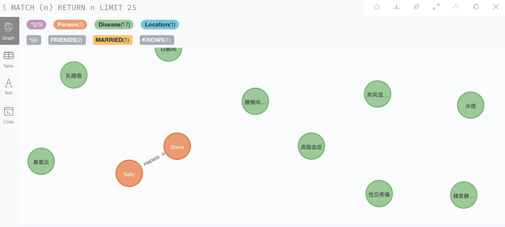
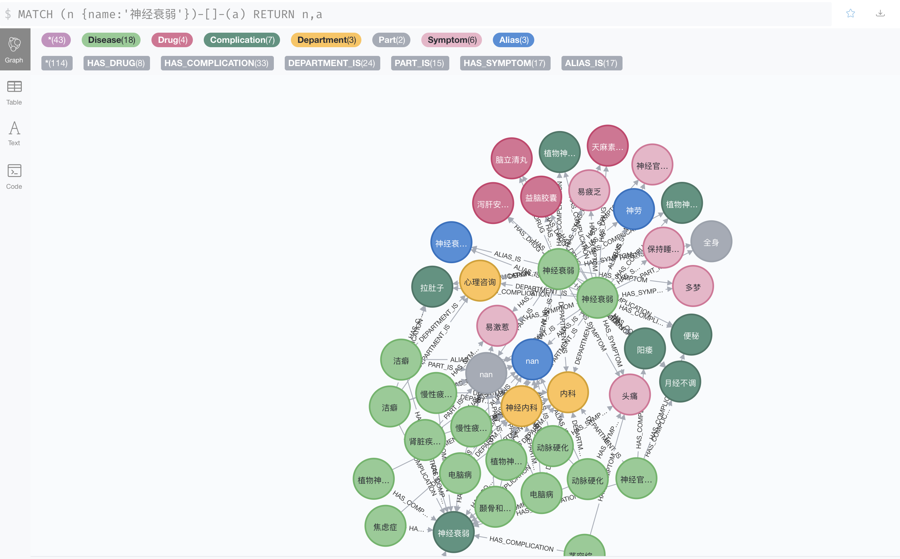
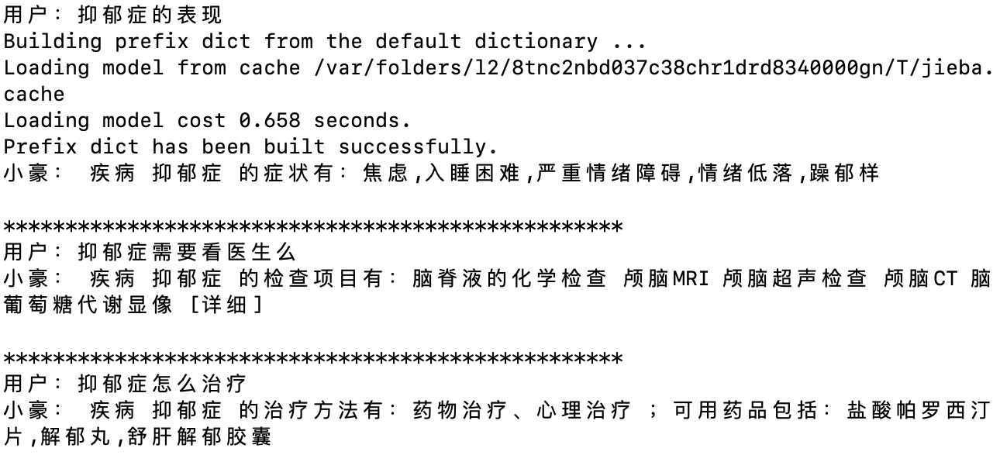

# Datawhale 知识图谱组队学习 之 Task 2 基于医疗知识图谱的问答系统操作介绍

## 〇、目录

[toc]

## 一、引言

- 该项目主要分为两部分：
  1. 搭建知识图谱。具体参考Task 3

  2. 启动问答测试。构建一个简单的基于 知识图谱 的对话系统，具体参考task 4、Task 5 

- 核心目标

  1.  从全局对项目的运行过程进行介绍和讲解；
  2. 学习者能够跑通整个项目。

## 二、运行环境

- python3.0及以上
- neo4j 3.5.0及以上
- jdk 1.8.0

除此之外，还需要

1. 从[QASystemOnMedicalGraph](https://github.com/zhihao-chen/QASystemOnMedicalGraph)下载代码
2. pip install 相关包：pyahocorasick（精确或近似的多模式字符串搜索）、jieba（中文分词）、gensim（自然语言工具）、scikit-learn==0.20.3（机器学习工具、不要版本过高）
3. 下载词向量文件：merge_sgns_bigram_char300.txt （https://drive.google.com/file/d/1kSAl4_AOg3_6ayU7KRM0Nk66uGdSZdnk/view）

## 三、搭建知识图谱

运行 以下命令：

```s
    python build_graph.py 
```

> 注：由于数据量比较大，所以该过程需要运行几个小时 

运行介绍之后，打开浏览器进入网址：[http://localhost:7474/browser/](http://localhost:7474/browser/)，可以看到我们导入的数据的知识图谱，如下：



查询从"神经衰弱"出发相关的点



## 四、启动问答测试

运行 以下命令：

```s
    python kbqa_test.py
```

报错：importError: cannot import name 'joblib' from 'sklearn.externals'

原因：sklearn 版本过高

解决方案：重新安装低版本的sklearn

```
pip uninstall scikit-learn
pip install scikit-learn==0.20.3
```

运行结果如下图所示：



## 五、代码目录介绍
- data:存放数据
- img:存放readme里的图片
- model：存放训练好的tfidf模型和意图识别模型
- build_graph.py:构建图，详见task03
- entity_extractor.py:抽取问句中的实体和识别意图，详见task04
- search_answer.py:根据不同的实体和意图构造cypher查询语句,查询图数据库并返回答案，详见task05

## 参考资料 

1. [QASystemOnMedicalGraph](https://github.com/zhihao-chen/QASystemOnMedicalGraph)
